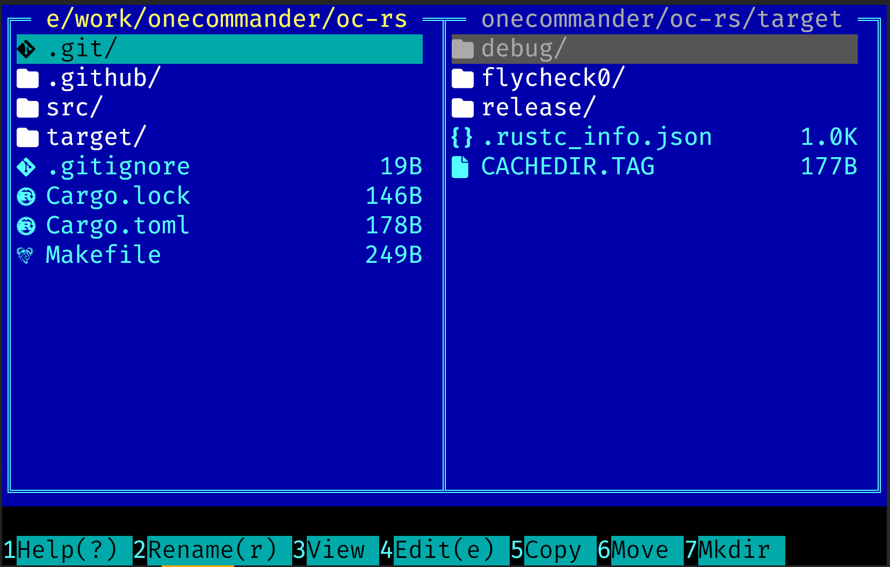

# One Commander

Usable two-pane terminal file manager. Zero external dependencies. Static musl binary.



## Features

- Two-pane layout with independent navigation
- Directory browsing with Nerd Font icons
- File operations: copy (with progress bar), move, rename, mkdir
- **XDG Trash** — delete moves files to `~/.local/share/Trash` (recoverable via any trash tool)
- Multi-file selection with `Space` / `Insert` / `Ctrl+A`
- **Visual marker mode** (`V`) — select a range of files like Vim visual line mode
- Incremental search (`/`) with `n`/`N` navigation — full UTF-8 support
- Sortable file list (name / size / extension, ascending / descending)
- Human-readable file sizes
- rclone remote mount support with detailed error output on failure
- 24-bit truecolor CGA palette
- Mouse support (click, scroll, right-click)
- `--dump` flag for plain-text UI snapshot (useful for LLM debugging)

## Key Bindings

### Navigation

| Key | Action |
|-----|--------|
| `Tab` / `Shift+Tab` | Switch active pane |
| `↑` `↓` / `j` `k` | Move cursor |
| `PgUp` / `PgDn` | Page up / down |
| `Home` / `End` | First / last entry |
| `gg` / `G` | Top / bottom |
| `Space` / `/` | Incremental search (UTF-8) |
| `n` / `N` | Next / prev match |
| `Enter` / `→` | Enter directory or open file |
| `←` / `Backspace` | Parent directory |

### Selection

| Key | Action |
|-----|--------|
| `V` | Toggle visual marker mode (range select like Vim) |
| `Insert` | Toggle selection + move down |
| `Space` | Toggle selection |
| `Ctrl+A` | Select all |
| `Esc` | Deselect all / exit marker mode |

### File Operations

| Key | Action |
|-----|--------|
| `F1` / `?` | This help |
| `F2` / `r` | Rename |
| `F3` | View in pager |
| `F4` / `e` | Edit file |
| `F5` | Copy to other pane |
| `F6` | Move to other pane |
| `F7` | Create directory |
| `F8` / `dd` / `Del` | Move to XDG Trash |
| `F9` | Context menu |
| `F10` / `q` | Quit |

### Misc

| Key | Action |
|-----|--------|
| `S` | Sync panes (copy path to other) |
| `#` | Go to path (Tab to cycle matching subdirs) |
| `s` | Sort by name / size / extension |
| `R` | Refresh |
| `C` | rclone remote mount |

### Mouse

| Action | Effect |
|--------|--------|
| Left click | Switch pane / move cursor |
| Double click | Enter dir or open file |
| Right click | Go to parent directory |
| Scroll | Move cursor ±3 rows |

## CLI Flags

```
oc [left-path] [right-path]   open with given directories
oc --dump [left] [right]       print plain-text UI snapshot to stdout
oc --dump --width 160 ...      set dump width (default: 120)
oc --help                      show key bindings
```

The `--dump` output mirrors the two-pane layout with `>` marking the cursor and `*` marking selected files — useful for pasting to an LLM for debugging.

## Install

```
make install
```

Binary installed to `~/.local/bin/oc`.
